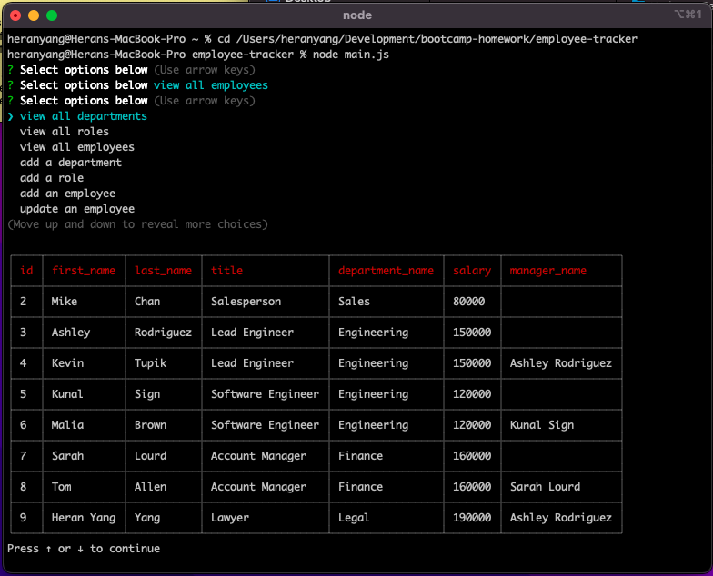

<div align="center">
  <h3 align="center">Employee Tracker</h3>

  <p align="center">
    This CLI app will generate a team profile following a preset format.
    <br />
    <a href="https://github.com/heranYang93/employee-tracker/blob/main/demo/demo_basicFunction.mov">View Demo</a>
    ·
    <a href="https://github.com/heranyang93/employee-tracker/issues">Report Bug</a>
    ·
    <a href="https://github.com/heranyang93/employee-tracker/issues">Request Feature</a>
  </p>
</div>

<details>
  <summary>Table of Contents</summary>
  <ol>
    <li>
      <a href="#about-the-project">About The Project</a>
      <ul>
        <li><a href="#user-story">User Story</a></li>
        <li><a href="#acceptance-criteria">Acceptance Criteria</a></li>
        <li><a href="#built-with">Built With</a></li>
      </ul>
    </li>
    <li>
      <a href="#getting-started">Getting Started</a>
      <ul>
        <li><a href="#prerequisites">Prerequisites</a></li>
        <li><a href="#installation">Installation</a></li>
      </ul>
    </li>
    <li><a href="#usage">Usage</a></li>
    <li><a href="#contact">Contact</a></li>
    <li><a href="#acknowledgments">Acknowledgments</a></li>
  </ol>
</details>

## About The Project



Developers frequently have to create interfaces that allow non-developers to easily view and interact with information stored in databases. These interfaces are called **content management systems (CMS)**. This command-line application is to manage a company's employee database, using Node.js, Inquirer, and MySQL.

<p align="right">(<a href="#top">back to top</a>)</p>

### User Story

```md
AS A manager
I WANT to generate a webpage that displays my team's basic info
SO THAT I have quick access to their emails and GitHub profiles
```

<p align="right">(<a href="#top">back to top</a>)</p>

### Acceptance Criteria

- GIVEN a command-line application that accepts user input

- WHEN I start the application
  `THEN I am presented with the following options: view all departments, view all roles, view all employees, add a department, add a role, add an employee, and update an employee role.`

- WHEN I choose to view all departments
  `THEN I am presented with a formatted table showing department names and department ids`

- WHEN I choose to view all roles
  `THEN I am presented with the job title, role id, the department that role belongs to, and the salary for that role`

- WHEN I choose to view all employees
  `THEN I am presented with a formatted table showing employee data, including employee ids, first names, last names, job titles, departments, salaries, and managers that the employees report to`

- WHEN I choose to add a department
  `THEN I am prompted to enter the name of the department and that department is added to the database`

- WHEN I choose to add a role
  `THEN I am prompted to enter the name, salary, and department for the role and that role is added to the database`

- WHEN I choose to add an employee
  `THEN I am prompted to enter the employee’s first name, last name, role, and manager, and that employee is added to the database`

- WHEN I choose to update an employee role
  `THEN I am prompted to select an employee to update and their new role and this information is updated in the database`

<p align="right">(<a href="#top">back to top</a>)</p>

### Built With

The following dependencies/resources have been used:

- [Node.js](https://nodejs.org/en/)
- [Inquirer.js](https://www.npmjs.com/package/inquirer)
- [dotenv](https://github.com/motdotla/dotenv#readme)
- [mysql2](https://github.com/sidorares/node-mysql2)
- [mySQL](https://www.mysql.com/)
- [cli-table](https://github.com/Automattic/cli-table)

<p align="right">(<a href="#top">back to top</a>)</p>

## Getting Started

### Prerequisites

- Node must be installed
- mySQL must be installed

### Installation

- Install all necessary dependencies
  - Inquirer, dotenv, mysql2, and cli-table must be installed
  - Point the terminal to the main directory and run the following command
  ```sh
  npm start
  ```

<p align="right">(<a href="#top">back to top</a>)</p>

## Usage

- Point the terminal to the main directory

- Run the following command in mySQL CLI
  `SOURCE db/schema.sql`

- Quit mySQL command line
  `quit;`

- In command line, run
  `npm run start`

<p align="right">(<a href="#top">back to top</a>)</p>

## Contact

Heran Yang- [LinkedIn](https://www.linkedin.com/in/heranyang/)

Project Link: [https://github.com/heranyang93/team-profile-generator](https://github.com/heranyang93/team-profile-generator)

<p align="right">(<a href="#top">back to top</a>)</p>

## Acknowledgments

- [Img Shields](https://shields.io)
- [GitHub Pages](https://pages.github.com)
